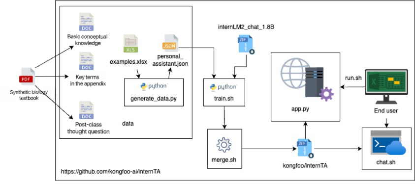

# internTA: "Synthetic Biology" Teaching Assistant Based on InternLM2 Large Language Model

<div align="center"></div>

## Abstract

Model repository：[[OpenXLab]](https://openxlab.org.cn/models/detail/Kongfoo_EC/internTA)

Demo video：[[Google Drive]](https://drive.google.com/file/d/1ZuOSX62aLsM21x3F_5N3jznDHkPgDigJ/view?usp=sharing)

Online experience Demo：[[Powered by Coze]](https://ecopi.chat/)


## Background
From lab-grown meat, synthetic proteins to the gene-editing technology CRISPR-Cas9, synthetic biology has been flourishing across various fields in recent years, leading what is being termed the "Third Biotechnology Revolution." However, the dissemination of synthetic biology knowledge faces several challenges:

On one hand, synthetic biology is an interdisciplinary field that combines knowledge from biology, chemistry, engineering, and computer science. Many cutting-edge technologies play an indispensable role in advancing synthetic biology.

On the other hand, there is still a gap between China and advanced developed countries in the field of biotechnology, and China is in a state of catching up. There is a significant shortage of teachers and professionals with cross-disciplinary knowledge and rich practical experience.

To address these shortcomings, we have developed the "Synthetic Biology" teaching assistant, InternTA, based on the InternLM2 large language model. The aim is to help students to learn the "Synthetic Biology" course. By providing keywords and ideas, and pointing out relevant chapters in textbooks, we hope that InternTA could guide students to think independently, thereby achieving high-quality learning of synthetic biology knowledge and fulfilling the goal of "teaching a man to fish rather than giving him a fish.”

## Introduction
InternTA draws material from the "Synthetic Biology" textbook. It uses a semi-automated approach to generate instructional dialogues as a fine-tuning dataset. The [Xtuner](https://github.com/InternLM/xtuner) is employed to fine-tune the base model [InternLM2-Chat-1.8B-SFT](https://modelscope.cn/models/Shanghai_AI_Laboratory/internlm2-chat-1_8b-sft/summary), and Streamlit is used as the framework to develop a web-based DEMO application.

The implementation principle of InternTA is shown in the diagram below:

<div align="center"></div>


One of the most critical steps is the preparation of fine-tuning data. We have prepared two types of fine-tuning training data: direct Q&A data and guided Q&A data. The steps for preparing the fine-tuning data are shown in the diagram below:

<div align="center"></div>

> - First, we compile a question bank, which mainly includes three categories: post-class thought questions, key terms in the appendix, and fundamental concept knowledge. We then search for corresponding answers in the "Synthetic Biology" textbook based on these questions.
> - Next, we organize the retrieved answers to form a response database that the teaching assistant can use. For key terms and fundamental concept knowledge, we provide direct answers to engage with the users.
> - For the post-class thought questions in the "Synthetic Biology" textbook, we use a larger parameter-scale language model (such as GPT-4) to rewrite the correct answers into a guided response format, avoiding directly providing users with the standard answers.

## Quick Experience

**Online Experience Address**: [[Powered by Coze]](https://www.kongfoo.cloud/)

**Local Experience Method (NVIDIA GPU with 8GB or more VRAM)**:

```sh
# Clone the repository
git clone https://github.com/kongfoo-ai/internTA

# Go to the project directory
cd InternTA

# Install the dependencies
pip install -r requirements.txt

# Start demo (The default port is 8080. You can change it if necessary)
sh run.sh

# View run logs 
tail -f nohup.out
```

## User Guide

### 1.Generating Training Data

Install dependencies.

```sh
pip install -r requirements.txt
```

Generate training data using the open-source example.

```sh
cd data
python generate_data.py
```

### 2.Model Fine-Tuning

Go to the project root directory

```sh
cd $ROOT_PATH 
```

Check if there is a file named personal_assistant.json in the data directory.

```sh
ls -lh data
```

Fine-tune the model using the data generated in the previous steps and the Xtuner tool.

```sh
sh train.sh
```

Observe the model weights in the train directory. The naming convention for the directory is pth_$NUM_EPOCH.
```sh
ls -lh train
```

Merge the fine-tuned Adapter into the base model.

```sh
# Note: You need to pass the suffix of the directory containing the weights to be merged as a parameter to specify which LORA parameters to merge.
sh merge.sh $NUM_EPOCH
```

### 3.Model Testing

Test the final merged model in the final directory.

```sh
# Note: Modify the model path as needed
sh chat.sh
```
### 4. Model Response Evaluation

This section is used to calculate the ROUGE similarity scores for responses generated by the InternTA model and generate evaluation results.

Run the evaluation script:

```sh
# Ensure your SynBio-Bench.json file is in the correct directory
pytest ./test/test_model_evaluation.py
```

This command will process the data file and output the results to the `test_results.csv` file.

The unit tests in the script are used to verify that the answers obtained from the model API are valid and that the ROUGE similarity score calculations are correct.


## Special Thanks

- [InternLM2-Chat-1.8B-SFT](https://modelscope.cn/models/Shanghai_AI_Laboratory/internlm2-chat-1_8b-sft/summary)
- [internDog](https://github.com/BestAnHongjun/InternDog)
- [Xtuner](https://github.com/InternLM/xtuner)
