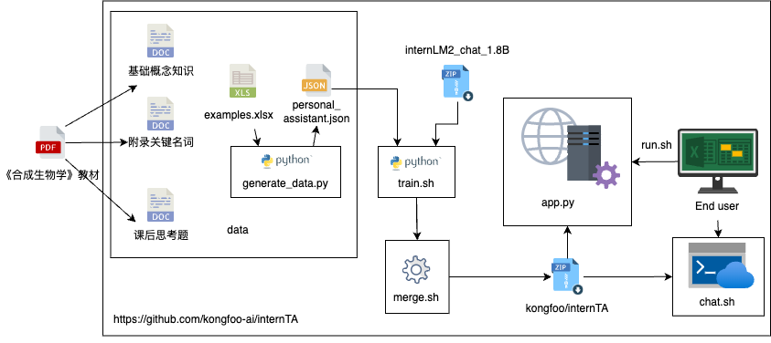
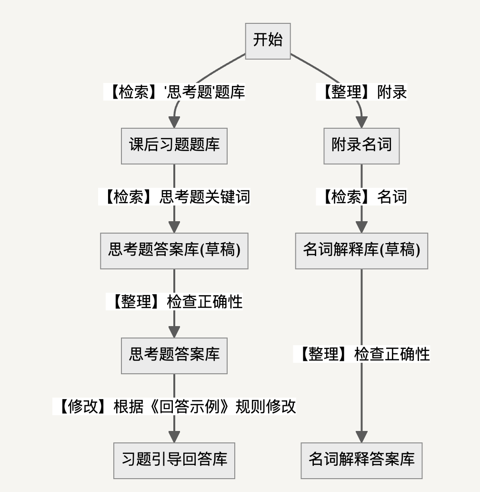

# InternTA: 从有限数据中学习的多智能体AI助教系统

[中文版](README-zh.md) | [English Version](README.md)

<div align="center"></div>

## 摘要

大型语言模型(LLM)作为AI助教(TA)已展现出增强学生学习体验的巨大潜力。然而，现有的基于LLM的助教系统面临关键挑战：第三方API解决方案带来的数据隐私风险，以及在教学资料有限的课程中效果不佳。

本项目提出了一种基于LLM智能体的自动化TA训练系统，旨在训练定制化、轻量级且保护隐私的AI模型。不同于传统云端AI助教，我们的系统支持本地部署，减少数据安全隐患，包含三个核心组件：

1. **数据集智能体**：构建包含明确推理路径的高质量数据集
2. **训练智能体**：通过知识蒸馏微调模型，有效适应数据有限的课程
3. **RAG智能体**：通过检索外部知识增强回答质量

我们在合成生物学这一结构化训练数据稀缺的交叉学科领域进行验证。实验结果和用户评估表明，我们的AI助教达到了强大性能、高用户满意度和提升学生参与度的目标，突显了其在实际教育环境中的应用价值。

## 背景

合成生物学是一门融合生物学、化学、工程学和计算机科学等多学科知识的前沿领域，近年来从人造肉到基因编辑技术CRISPR-Cas9等应用引领着"第三次生物技术革命"。然而，合成生物学知识的普及面临两大挑战：

1. 学科交叉复杂性：需要整合多领域知识，学习曲线陡峭
2. 教育资源不足：具备跨领域知识和实践经验的教师人才匮乏

传统的AI助教解决方案通常依赖云服务API，带来数据隐私风险，且在专业领域教学资料有限的情况下表现欠佳。InternTA项目正是为解决这些问题而设计。

## 技术架构

InternTA采用三层智能体架构，实现自动化训练、本地部署和隐私保护：

<div align="center"></div>

### 1. 数据集智能体

数据集智能体负责构建高质量训练数据，包含明确推理路径：

<div align="center"></div>

- **数据来源**：从《合成生物学》教材中提取课后思考题、关键名词和基础概念
- **推理路径构建**：为每个问题生成包含思考过程的明确推理路径
- **引导式教学设计**：对复杂思考题，设计引导式回答而非直接提供答案

**实现**：`data/generate_data.py`处理Excel文件(`data/examples.xlsx`)并生成训练(`data/training.json`)和验证(`data/validation.json`)数据集，采用OpenAI对话格式。

### 2. 训练智能体

训练智能体通过知识蒸馏技术微调轻量级模型：

- **基础模型**：使用[DeepSeek-R1-Distill-Qwen-7B](https://huggingface.co/deepseek-ai/DeepSeek-R1-Distill-Qwen-7B)作为基础模型
- **微调工具**：采用[PEFT](https://github.com/huggingface/peft)进行高效微调，使用QLoRA(4位量化)
- **知识蒸馏**：从更大参数规模模型中蒸馏知识到轻量级模型
- **自动化规划**：包含LLM评判器用于自动生成和调整训练计划

**实现**：`train/train_agent.py`提供可配置超参数的智能体训练。基础监督微调通过`train/sft_internTA2.py`实现。配置文件位于`config/internlm2_1_8b_qlora_alpaca_e3_copy.py`。

### 3. RAG智能体

RAG(检索增强生成)智能体通过检索外部知识增强回答质量：

- **知识库构建**：结构化处理《合成生物学》教材内容
- **语义检索**：根据用户问题检索相关知识点
- **增强生成**：结合检索到的知识生成更准确、更有深度的回答

**实现**：RAG功能集成到Web界面和API中，用于增强响应生成。

## 隐私保护与本地部署

InternTA系统设计强调数据隐私保护和部署灵活性：

- **本地模型部署**：所有模型可在本地机器上运行，避免数据外传
- **API令牌认证**：提供API访问控制机制保护系统安全
- **轻量级设计**：优化模型尺寸，使其能在普通硬件上高效运行

## 快速体验

**在线体验地址**：[[E. Copi (Education)]](https://ita.ecopi.chat)

**本地部署方法**(8G显存以上NVIDIA GPU)：

```sh
# 克隆仓库
git clone https://github.com/kongfoo-ai/internTA

# 进入项目目录
cd internTA

# 安装依赖
pip install -r requirements.txt

# 设置 API 访问令牌（可选）
# 在项目根目录创建或编辑 .env 文件，添加 API_TOKEN=your-secret-token

# 启动demo, 默认端口为8080如有需要可以修改
sh run.sh

# 查看运行日志
tail -f nohup.out
```

## API 认证

InternTA API服务器(`api.py`)支持基于Bearer令牌的身份验证。要启用此功能：

1. 在项目根目录的 `.env` 文件中设置 `API_TOKEN` 环境变量：
   ```
   API_TOKEN=your-secret-token
   ```

2. 向 API 发送请求时，在请求头中包含 Authorization 字段：
   ```
   Authorization: Bearer your-secret-token
   ```

3. 如果未在 `.env` 文件中设置 `API_TOKEN`，则认证将被跳过，API 将允许所有请求。

4. 您可以使用提供的 `test_auth.py` 脚本测试身份验证功能：
   ```sh
   python test/test_auth.py
   ```

## 使用教程

### 1. 数据集智能体训练

安装依赖项。

```sh
pip install -r requirements.txt
```

生成高质量训练数据集。

```sh
cd data
python generate_data.py
```

这将在`data/`目录下创建`training.json`和`validation.json`文件。

### 2. 训练智能体微调

**选项A：基础训练**
```sh
# 运行基础监督微调（注意：train.sh引用sft_internta.py但实际文件为sft_internTA2.py）
sh train.sh

# 替代方案：直接运行监督微调
python train/sft_internTA2.py --model_name model --model_save_path output --dataset_name dataset
```

**选项B：高级智能体训练**
```sh
# 运行带自动化规划的智能体训练
sh traino.sh
```

训练脚本使用QLoRA(4位量化)进行高效微调。模型检查点保存在`training_output/`目录（或按配置）。

### 3. 模型合并

将微调得到的LoRA适配器与基础模型合并，创建独立模型：

```sh
python merge.py --base-model <基础模型路径> --lora-adapter <LoRA适配器路径> --output-path <输出路径>
```

示例：
```sh
python merge.py --base-model deepseek-ai/DeepSeek-R1-Distill-Qwen-7B --lora-adapter training_output/checkpoint-100 --output-path merged_model
```

### 4. 模型评估

使用ROUGE相似度分数评估模型响应：

```sh
# 确保你的 SynBio-Bench.json 文件存在于正确的目录下
pytest ./test/test_model_evaluation.py
```

该命令将处理数据文件，并输出结果到 test_results.csv 文件。

### 5. 运行应用程序

**Web界面(Streamlit)**：
```sh
sh run.sh
# 或直接运行：
CUDA_VISIBLE_DEVICES=0 streamlit run app.py --server.address=0.0.0.0 --server.port 8080 --server.fileWatcherType none -- --show-local-option --local
```

**API服务器(FastAPI)**：
```sh
python api.py
```

API服务器在`/v1/chat/completions`提供OpenAI兼容的端点。

## 项目结构

```
internTA/
├── api.py                 # FastAPI服务器，提供OpenAI兼容的端点
├── app.py                 # Streamlit Web界面，支持本地/远程模式切换
├── requirements.txt       # Python依赖
├── run.sh                 # Web界面启动脚本
├── train.sh               # 基础训练脚本
├── traino.sh              # 高级智能体训练脚本
├── merge.py               # 模型合并工具
├── data/                  # 数据集生成和处理
│   ├── generate_data.py   # 数据集智能体实现
│   ├── examples.xlsx      # 原始Excel数据
│   ├── training.json      # 生成的训练数据
│   └── validation.json    # 生成的验证数据
├── train/                 # 模型训练脚本
│   ├── train_agent.py     # 主训练智能体，支持自动化规划
│   ├── sft_internTA2.py   # 监督微调脚本
│   └── zero_to_fp32.py    # 模型转换工具
├── test/                  # 测试和评估
│   ├── test_model_evaluation.py  # ROUGE分数评估
│   └── test_auth.py       # API认证测试
├── config/                # 配置文件
│   └── internlm2_1_8b_qlora_alpaca_e3_copy.py  # 训练配置
├── web/                   # Web界面资源
├── statics/               # 静态资源（图片、演示GIF）
└── docs/                  # 文档
```

## 特别鸣谢

- [DeepSeek-R1-Distill-Qwen-7B](https://huggingface.co/deepseek-ai/DeepSeek-R1-Distill-Qwen-7B)
- [internDog](https://github.com/BestAnHongjun/InternDog)
- [Peft](https://github.com/huggingface/peft)