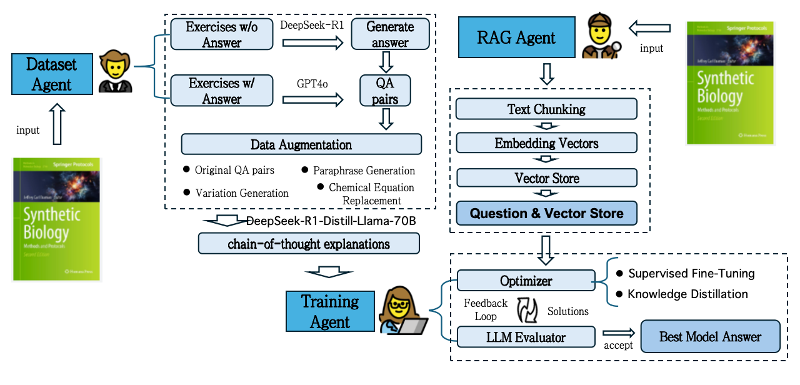
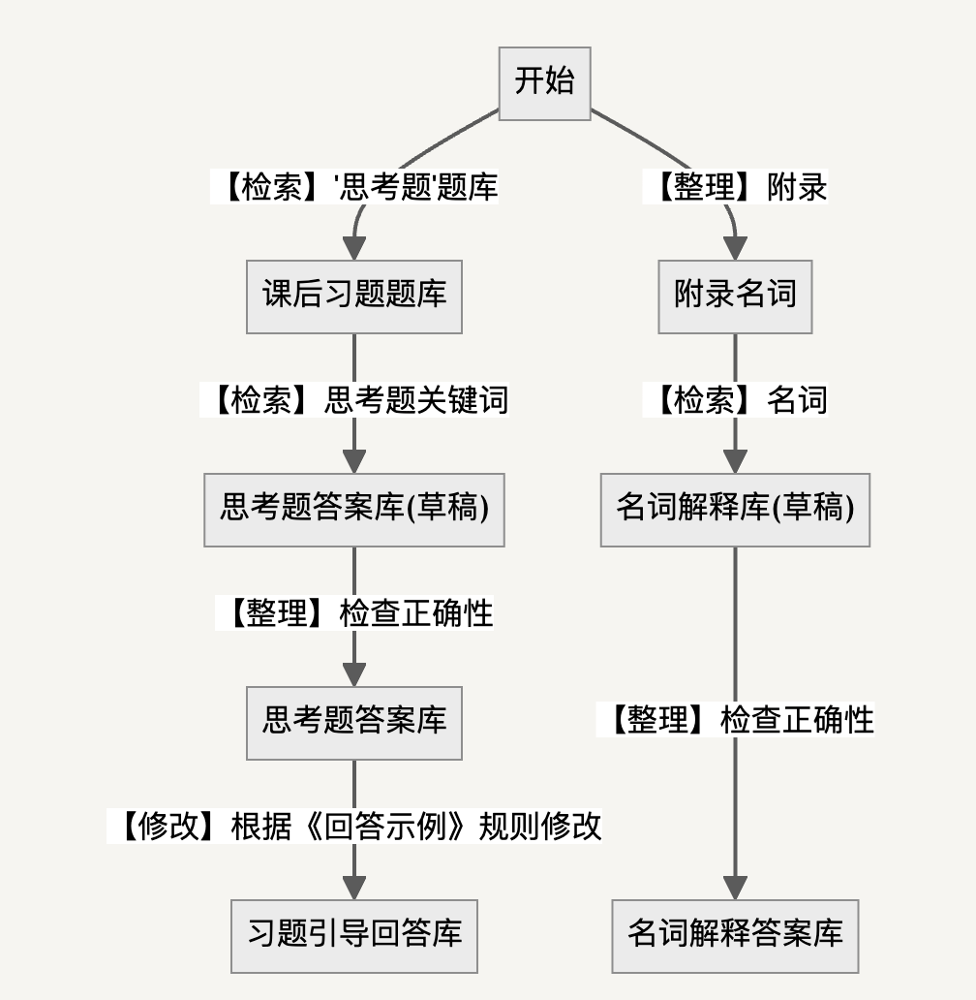

# InternTA: 从有限数据中学习的多智能体AI助教系统

[中文版](README.md) | [English Version](README-EN.md)

<div align="center"></div>

## 摘要

模型仓库：[[OpenXLab]](https://openxlab.org.cn/models/detail/Kongfoo_EC/internTA)

演示视频：[[Bilibili]](https://www.bilibili.com/video/BV1xRe2eHEsF)

在线体验Demo：[[Powered by Coze]](https://ecopi.chat/)

大型语言模型(LLM)作为AI助教(TA)已展现出增强学生学习体验的巨大潜力。然而，现有的基于LLM的助教系统面临关键挑战：第三方API解决方案带来的数据隐私风险，以及在教学资料有限的课程中效果不佳。

本项目提出了一种基于LLM智能体的自动化TA训练系统，旨在训练定制化、轻量级且保护隐私的AI模型。不同于传统云端AI助教，我们的系统支持本地部署，减少数据安全隐患，包含三个核心组件：

1. **数据集智能体**：构建包含明确推理路径的高质量数据集
2. **训练智能体**：通过知识蒸馏微调模型，有效适应数据有限的课程
3. **RAG智能体**：通过检索外部知识增强回答质量

我们在合成生物学这一结构化训练数据稀缺的交叉学科领域进行验证。实验结果和用户评估表明，我们的AI助教达到了强大性能、高用户满意度和提升学生参与度的目标，突显了其在实际教育环境中的应用价值。

## 背景

合成生物学是一门融合生物学、化学、工程学和计算机科学等多学科知识的前沿领域，近年来从人造肉到基因编辑技术CRISPR-Cas9等应用引领着"第三次生物技术革命"。然而，合成生物学知识的普及面临两大挑战：

1. 学科交叉复杂性：需要整合多领域知识，学习曲线陡峭
2. 教育资源不足：具备跨领域知识和实践经验的教师人才匮乏

传统的AI助教解决方案通常依赖云服务API，带来数据隐私风险，且在专业领域教学资料有限的情况下表现欠佳。InternTA项目正是为解决这些问题而设计。

## 技术架构

InternTA采用三层智能体架构，实现自动化训练、本地部署和隐私保护：

<div align="center"></div>

### 1. 数据集智能体

数据集智能体负责构建高质量训练数据，包含明确推理路径：

<div align="center"></div>

- **数据来源**：从《合成生物学》教材中提取课后思考题、关键名词和基础概念
- **推理路径构建**：为每个问题生成包含思考过程的明确推理路径
- **引导式教学设计**：对复杂思考题，设计引导式回答而非直接提供答案

### 2. 训练智能体

训练智能体通过知识蒸馏技术微调轻量级模型：

- **基础模型**：使用[InternLM2-Chat-1.8B-SFT](https://modelscope.cn/models/Shanghai_AI_Laboratory/internlm2-chat-1_8b-sft/summary)作为基础模型
- **微调工具**：采用[Xtuner](https://github.com/InternLM/xtuner)进行高效微调
- **知识蒸馏**：从更大参数规模模型中蒸馏知识到轻量级模型

### 3. RAG智能体

RAG(检索增强生成)智能体通过检索外部知识增强回答质量：

- **知识库构建**：结构化处理《合成生物学》教材内容
- **语义检索**：根据用户问题检索相关知识点
- **增强生成**：结合检索到的知识生成更准确、更有深度的回答

## 隐私保护与本地部署

InternTA系统设计强调数据隐私保护和部署灵活性：

- **本地模型部署**：所有模型可在本地机器上运行，避免数据外传
- **API令牌认证**：提供API访问控制机制保护系统安全
- **轻量级设计**：优化模型尺寸，使其能在普通硬件上高效运行

## 快速体验

**在线体验地址**：[[Powered by Coze]](https://www.kongfoo.cloud/)

**本地部署方法**(8G显存以上NVIDIA GPU)：

```sh
# 克隆仓库
git clone https://github.com/kongfoo-ai/internTA

# 进入项目目录
cd InternTA

# 安装依赖
pip install -r requirements.txt

# 设置 API 访问令牌（可选）
# 在项目根目录创建或编辑 .env 文件，添加 API_TOKEN=your-secret-token

# 启动demo, 默认端口为8080如有需要可以修改
sh run.sh

# 查看运行日志 
tail -f nohup.out
```

## API 认证

InternTA API 服务器支持基于 Bearer 令牌的身份验证。要启用此功能：

1. 在项目根目录的 `.env` 文件中设置 `API_TOKEN` 环境变量：
   ```
   API_TOKEN=your-secret-token
   ```

2. 向 API 发送请求时，在请求头中包含 Authorization 字段：
   ```
   Authorization: Bearer your-secret-token
   ```

3. 如果未在 `.env` 文件中设置 `API_TOKEN`，则认证将被跳过，API 将允许所有请求。

4. 您可以使用提供的 `test_auth.py` 脚本测试身份验证功能：
   ```sh
   python test_auth.py
   ```

## 使用教程

### 1. 数据集智能体训练

安装依赖项。

```sh
pip install -r requirements.txt
```

生成高质量训练数据集。

```sh
cd data
python generate_data.py
```

### 2. 训练智能体微调

进入项目根目录

```sh
cd $ROOT_PATH 
```

检查data目录下是否有名为`personal_assistant.json`的数据。

```sh
ls -lh data
```

使用数据集智能体生成的数据和xtuner工具微调模型。

```sh
sh train.sh
```

观察train目录下的到的模型权重，目录的命名规则为`pth_$NUM_EPOCH`。
```sh
ls -lh train
```

将微调得到的Adapter合并至基模型。

```sh
# 注意需要将待合并权重的目录后缀作为参数传入，用于指定合并哪个目录下的LORA参数
sh merge.sh $NUM_EPOCH
```

### 3. 本地模型评估

测试final目录下最终合并后的模型。

```sh
# 注意修改模型路径
sh chat.sh
```

### 4. RAG智能体评估
 
该部分用于计算 InternTA 模型回答的 ROUGE 相似度分数，生成评测结果。

```sh
#确保你的 SynBio-Bench.json 文件存在于正确的目录下
pytest ./test/test_model_evaluation.py
```

该命令将处理数据文件，并输出结果到 test_results.csv 文件。

## 特别鸣谢

- [InternLM2-Chat-1.8B-SFT](https://modelscope.cn/models/Shanghai_AI_Laboratory/internlm2-chat-1_8b-sft/summary)
- [internDog](https://github.com/BestAnHongjun/InternDog)
- [Xtuner](https://github.com/InternLM/xtuner)
