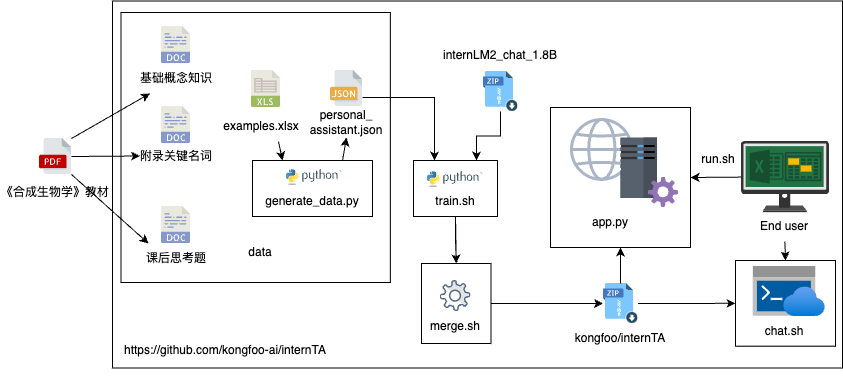

# internTA: 基于InternLM2大模型的《合成生物学》助教

[中文版](README.md) | [English Version](README-EN.md)

<div align="center"></div>

## 摘要

模型仓库：[[OpenXLab]](https://openxlab.org.cn/models/detail/Kongfoo_EC/internTA)

演示视频：[[Google Drive]](https://drive.google.com/file/d/1ZuOSX62aLsM21x3F_5N3jznDHkPgDigJ/view?usp=sharing)

在线体验Demo：[[Powered by Coze]](https://www.kongfoo.cloud/)

## 背景

从人造肉、人造蛋白，到基因编辑技术 CRISPR-Cas9，近年来， 合成生物学在各个领域落地开花，引领着一场被称为“第三次生物技术革命”的科学浪潮。而合成生物学知识的普及，面临着以下的挑战：

一方面，合成生物学是一门融合了生物学、化学、工程学、计算机科学等领域知识的交叉学科，许多尖端技术都对合成生物学的进步起到了不可或缺的推动作用。

另一方面，我国在生物科技领域依旧和先进发达国家有着一定差距，处于追赶状态。特别是具有跨领域知识储备以及丰富实践经验的教师人才十分匮乏。

为弥补上述不足，我们开发了基于InternLM2大语言模型的《合成生物学》助教InternTA，旨在帮助学生更好地学习《合成生物学》这门课程。通过提供关键词和思路，并指出教材中相关的章节，我们希望开发的InternTA可以引导学生自行思考，从而完成对合成生物学知识的高质量学习，达到“授人以渔”的目的。


## 介绍

InternTA从《合成生物学》教材中取材，通过半自动化方式产生教学对话作为微调数据集，使用[Xtuner](https://github.com/InternLM/xtuner)工具对[InternLM2-Chat-1.8B-SFT](https://modelscope.cn/models/Shanghai_AI_Laboratory/internlm2-chat-1_8b-sft/summary)基础模型进行微调，使用streamlit作为框架开发网页端DEMO应用。

InternTA的实现原理如下图所示：

<div align="center"></div>

其中微调数据准备是最为关键的环节之一。我们准备的微调训练数据包含两类：直接问答数据和引导式问答数据。微调数据准备的步骤如下图所示：

<div align="center"></div>


> - 首先，我们整理出问题库，主要包括三类：课后思考题、附录关键名词和基础概念知识。我们根据这些问题在《合成生物学》教材中检索相应的答案。
> - 紧接着，我们整理检索到的答案，形成助教可以使用的回答数据库。对于关键名词和基础概念知识，我们会直接提供答案与用户交流。
> - 对于《合成生物学》教材的课后思考题，我们使用更大参数规模的大语言模型（如GPT4o）将正确答案改写成引导式回答形式，避免直接告知用户标准答案。


## 快速体验

**在线体验地址**：[[Powered by Coze]](https://www.kongfoo.cloud/)

**本地体验方法**(8G显存以上NVIDIA GPU)：

```sh
# 克隆仓库
git clone https://github.com/kongfoo-ai/internTA

# 进入项目目录
cd InternTA

# 安装依赖
pip install -r requirements.txt

# 启动demo, 默认端口为8080如有需要可以修改
sh run.sh

# 查看运行日志 
tail -f nohup.out
```

## 使用教程

### 1.训练数据生成

安装依赖项。

```sh
pip install -r requirements.txt
```

使用开源样例生成训练数据。

```sh
cd data
python generate_data.py
```

### 2.模型微调

进入项目根目录

```sh
cd $ROOT_PATH 
```

检查data目录下是否有名为`personal_assistant.json`的数据。

```sh
ls -lh data
```

使用data目录下以上步骤生成的到的数据以及xtuner工具微调模型。

```sh
sh train.sh
```

观察train目录下的到的模型权重，目录的命名规则为`pth_$NUM_EPOCH`。
```sh
ls -lh train
```

将微调得到的Adapter合并至基模型。

```sh
# 注意需要将待合并权重的目录后缀作为参数传入，用于指定合并哪个目录下的LORA参数
sh merge.sh $NUM_EPOCH
```

### 3.模型测试

测试final目录下最终合并后的模型。

```sh
# 注意修改模型路径
sh chat.sh
```

### 4.模型回答评估
 
该部分用于计算 InternTA 模型回答的 ROUGE 相似度分数，生成评测结果。

运行评估脚本

```sh
#确保你的 SynBio-Bench.json 文件存在于正确的目录下
pytest ./test/test_model_evaluation.py
```
该命令将处理数据文件，并输出结果到 test_results.csv 文件。

脚本中的单元测试用于验证从模型 API 获取的回答是否有效以及 ROUGE 相似度分数的计算是否正确。


## 特别鸣谢

- [InternLM2-Chat-1.8B-SFT](https://modelscope.cn/models/Shanghai_AI_Laboratory/internlm2-chat-1_8b-sft/summary)
- [internDog](https://github.com/BestAnHongjun/InternDog)
- [Xtuner](https://github.com/InternLM/xtuner)
