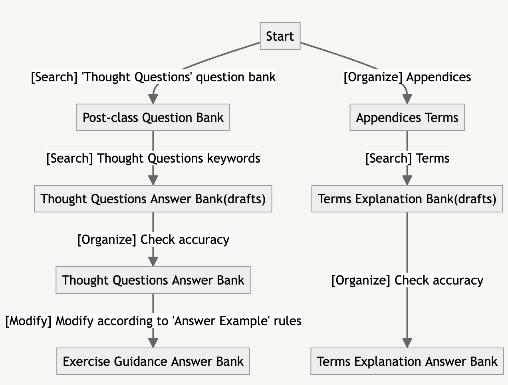

# InternTA: A Multi-agent AI Teaching Assistant Learns from Limited Data

[中文版](README-zh.md) | [English Version](README.md)

<div align="center"></div>

## Abstract

Large language models (LLMs) have shown great potential to enhance student learning by serving as AI-powered teaching assistants (TA). However, existing LLM-based TA systems often face critical challenges, including data privacy risks associated with third-party API-based solutions and limited effectiveness in courses with limited teaching materials.

This project proposes an automated TA training system based on LLM agents, designed to train customized, lightweight, and privacy-preserving AI models. Unlike traditional cloud-based AI TAs, our system allows local deployment, reducing data security concerns, and includes three components:

1. **Dataset Agent**: Constructing high-quality datasets with explicit reasoning paths
2. **Training Agent**: Fine-tuning models via Knowledge Distillation, effectively adapting to limited-data courses
3. **RAG Agent**: Enhancing responses by retrieving external knowledge

We validate our system in Synthetic Biology, an interdisciplinary field characterized by scarce structured training data. Experimental results and user evaluations demonstrate that our AI TA achieves strong performance, high user satisfaction, and improved student engagement, highlighting its practical applicability in real-world educational settings.

## Background

Synthetic biology is a cutting-edge field that integrates knowledge from biology, chemistry, engineering, and computer science. In recent years, applications ranging from lab-grown meat to CRISPR-Cas9 gene editing technology have been leading the "Third Biotechnology Revolution." However, the dissemination of synthetic biology knowledge faces two major challenges:

1. Interdisciplinary complexity: Requires integration of knowledge from multiple domains, creating a steep learning curve
2. Educational resource limitations: Shortage of teaching talent with cross-disciplinary knowledge and practical experience

Traditional AI teaching assistant solutions typically rely on cloud service APIs, which introduce data privacy risks and perform poorly when specialized teaching materials are limited. The InternTA project is designed to address these challenges.

## Technical Architecture

InternTA adopts a three-layer agent architecture to achieve automated training, local deployment, and privacy protection:

<div align="center"></div>

### 1. Dataset Agent

The Dataset Agent is responsible for constructing high-quality training data with explicit reasoning paths:

<div align="center"></div>

- **Data Sources**: Extracts post-class questions, key terms, and fundamental concepts from the "Synthetic Biology" textbook
- **Reasoning Path Construction**: Generates explicit reasoning paths for each question
- **Guided Teaching Design**: For complex thought questions, designs guided responses rather than providing direct answers

**Implementation**: `data/generate_data.py` processes Excel files (`data/examples.xlsx`) and generates training (`data/training.json`) and validation (`data/validation.json`) datasets in OpenAI conversation format.

### 2. Training Agent

The Training Agent fine-tunes lightweight models using knowledge distillation techniques:

- **Base Model**: Uses [DeepSeek-R1-Distill-Qwen-7B](https://huggingface.co/deepseek-ai/DeepSeek-R1-Distill-Qwen-7B) as the foundation model
- **Fine-Tuning Tools**: Employs [PEFT](https://github.com/huggingface/peft) for efficient fine-tuning with QLoRA (4-bit quantization)
- **Knowledge Distillation**: Transfers knowledge from larger parameter-scale models to lightweight models
- **Automated Planning**: Includes an LLM judge for automated training plan generation and adjustment

**Implementation**: `train/train_agent.py` provides advanced agent-based training with configurable hyperparameters. Basic supervised fine-tuning is available via `train/sft_internTA2.py`. Configuration is managed in `config/internlm2_1_8b_qlora_alpaca_e3_copy.py`.

### 3. RAG Agent

The RAG (Retrieval-Augmented Generation) Agent enhances answer quality by retrieving external knowledge:

- **Knowledge Base Construction**: Structured processing of "Synthetic Biology" textbook content
- **Semantic Retrieval**: Retrieves relevant knowledge points based on user questions
- **Enhanced Generation**: Combines retrieved knowledge to generate more accurate and in-depth answers

**Implementation**: RAG functionality is integrated into the web interface and API for enhanced response generation.

## Privacy Protection and Local Deployment

InternTA system design emphasizes data privacy protection and deployment flexibility:

- **Local Model Deployment**: All models can run on local machines, avoiding data exposure
- **API Token Authentication**: Provides API access control mechanisms to secure the system
- **Lightweight Design**: Optimizes model size to run efficiently on ordinary hardware

## Quick Experience

**Online Experience Address**: [[E. Copi (Education)]](https://ita.ecopi.chat)

**Local Deployment Method** (NVIDIA GPU with 8GB or more VRAM):

```sh
# Clone the repository
git clone https://github.com/kongfoo-ai/internTA

# Go to the project directory
cd internTA

# Install the dependencies
pip install -r requirements.txt

# Set API access token (optional)
# Create or edit the .env file in the project root directory, add API_TOKEN=your-secret-token

# Start demo (The default port is 8080. You can change it if necessary)
sh run.sh

# View run logs
tail -f nohup.out
```

## API Authentication

The InternTA API server (`api.py`) supports authentication using Bearer tokens. To enable this feature:

1. Set the `API_TOKEN` environment variable in the `.env` file in the project root directory:
   ```
   API_TOKEN=your-secret-token
   ```

2. Include the Authorization header in your requests to the API:
   ```
   Authorization: Bearer your-secret-token
   ```

3. If `API_TOKEN` is not set in the `.env` file, authentication will be skipped, and the API will allow all requests.

4. You can test the authentication feature using the provided `test_auth.py` script:
   ```sh
   python test/test_auth.py
   ```

## User Guide

### 1. Dataset Agent Training

Install dependencies.

```sh
pip install -r requirements.txt
```

Generate high-quality training dataset.

```sh
cd data
python generate_data.py
```

This will create `training.json` and `validation.json` files in the `data/` directory.

### 2. Training Agent Fine-Tuning

**Option A: Basic Training**
```sh
# Run basic supervised fine-tuning (note: train.sh references sft_internta.py but actual file is sft_internTA2.py)
sh train.sh

# Alternative: Run supervised fine-tuning directly
python train/sft_internTA2.py --model_name model --model_save_path output --dataset_name dataset
```

**Option B: Advanced Agent-Based Training**
```sh
# Run agent-based training with automated planning
sh traino.sh
```

The training scripts use QLoRA (4-bit quantization) for efficient fine-tuning. Model checkpoints are saved in the `training_output/` directory (or as configured).

### 3. Model Merging

Merge the fine-tuned LoRA adapter with the base model to create a standalone model:

```sh
python merge.py --base-model <BASE_MODEL_PATH> --lora-adapter <LORA_PATH> --output-path <OUTPUT_PATH>
```

Example:
```sh
python merge.py --base-model deepseek-ai/DeepSeek-R1-Distill-Qwen-7B --lora-adapter training_output/checkpoint-100 --output-path merged_model
```

### 4. Model Evaluation

Evaluate model responses using ROUGE similarity scores:

```sh
# Ensure your SynBio-Bench.json file is in the correct directory
pytest ./test/test_model_evaluation.py
```

This command will process the data file and output the results to the `test_results.csv` file.

### 5. Running the Application

**Web Interface (Streamlit)**:
```sh
sh run.sh
# or directly:
CUDA_VISIBLE_DEVICES=0 streamlit run app.py --server.address=0.0.0.0 --server.port 8080 --server.fileWatcherType none -- --show-local-option --local
```

**API Server (FastAPI)**:
```sh
python api.py
```

The API server provides OpenAI-compatible endpoints at `/v1/chat/completions`.

## Project Structure

```
internTA/
├── api.py                 # FastAPI server with OpenAI-compatible endpoints
├── app.py                 # Streamlit web interface with local/remote mode switching
├── requirements.txt       # Python dependencies
├── run.sh                 # Startup script for web interface
├── train.sh               # Basic training script
├── traino.sh              # Advanced agent-based training script
├── merge.py               # Model merging utility
├── data/                  # Dataset generation and processing
│   ├── generate_data.py   # Dataset agent implementation
│   ├── examples.xlsx      # Raw Excel data
│   ├── training.json      # Generated training data
│   └── validation.json    # Generated validation data
├── train/                 # Model training scripts
│   ├── train_agent.py     # Main training agent with automated planning
│   ├── sft_internTA2.py   # Supervised fine-tuning script
│   └── zero_to_fp32.py    # Model conversion utility
├── test/                  # Testing and evaluation
│   ├── test_model_evaluation.py  # ROUGE score evaluation
│   └── test_auth.py       # API authentication tests
├── config/                # Configuration files
│   └── internlm2_1_8b_qlora_alpaca_e3_copy.py  # Training configuration
├── web/                   # Web interface assets
├── statics/               # Static assets (images, demo GIF)
└── docs/                  # Documentation
```

## Special Thanks

- [DeepSeek-R1-Distill-Qwen-7B](https://huggingface.co/deepseek-ai/DeepSeek-R1-Distill-Qwen-7B)
- [internDog](https://github.com/BestAnHongjun/InternDog)
- [Peft](https://github.com/huggingface/peft)