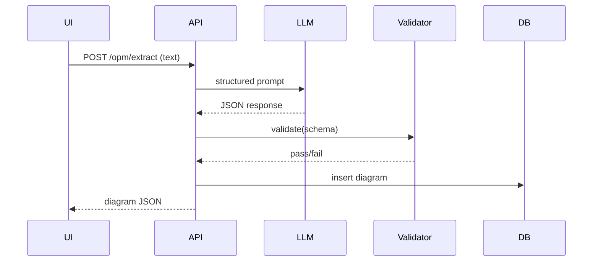

# Refactor `web/` for OPM Diagram Extraction (LLM-based)

---

## 1. Overview

The current system extracts action items using heuristic rules, producing flat, unstructured outputs. This refactor replaces that functionality with an LLM-based **OPM (Object-Process Methodology) diagram extraction system**, which produces structured graph representations.

### OPM Definition (Context)

OPM models systems using:

* **Objects**: entities that exist
* **Processes**: transformations that affect objects
* **States** (optional): conditions of objects
* **Links**:

  * Procedural: agent, instrument, consumption, result, effect
  * Structural: aggregation, specialization, characterization

This system extracts an **approximate OPM representation** from natural language text.

---

## 2. Goals

* Replace heuristic extraction with LLM-based structured extraction
* Enforce **strict schema-conformant JSON output**
* Implement a **robust validation layer**
* Enable configurable LLM backend (OpenAI-compatible)
* Persist diagrams for retrieval
* Provide graph-based frontend visualization

### Success Criteria

* ≥ 95% of valid responses pass schema validation without manual correction
* No invalid diagrams stored in DB
* Frontend renders diagrams deterministically

---

## 3. Non-Goals

* Full formal OPM correctness or simulation
* Automatic reasoning over diagrams
* High-performance or streaming LLM optimization
* Migration of legacy `action_items`
* Complex graph editing UI

---

## 4. Current State

* Heuristic extraction only (`extract_action_items`)
* No real LLM usage despite imports
* DB stores flat `action_items`
* API returns string arrays
* Frontend renders checklists
* Tests cover only heuristics

---

## 5. Proposed System

---

## 5.1 High-Level Architecture



---

## 5.2 Data Model (Schema)

### Versioning

```json
{
  "version": "1.0",
  "nodes": [...],
  "links": [...]
}
```

All stored diagrams must include a version field for backward compatibility.

---

### Node

| Field   | Type                               | Constraints             |
| ------- | ---------------------------------- | ----------------------- |
| `id`    | string                             | Unique, kebab-case slug |
| `kind`  | `"object" \| "process" \| "state"` | Strict enum             |
| `label` | string                             | Non-empty, ≤ 80 chars   |

State nodes are **optional** and should only be included when clearly implied.

---

### Link

| Field      | Type   | Constraints                  |
| ---------- | ------ | ---------------------------- |
| `id`       | string | Unique                       |
| `source`   | string | Must reference existing node |
| `target`   | string | Must reference existing node |
| `relation` | string | Strict enum                  |

Allowed relations:

* agent, instrument, consumption, result, effect
* aggregation, specialization, characterization

Strict enum design prevents schema drift.

---

### Diagram

```json
{
  "version": "1.0",
  "nodes": [],
  "links": []
}
```

---

## 5.3 LLM Integration

### Design Pattern

Schema-first extraction pipeline:

1. Define schema
2. Constrain LLM output
3. Validate strictly
4. Reject invalid outputs

---

### Prompt Contract

LLM must:

* Output **valid JSON only**
* Match schema exactly
* Use only allowed enums

Additional constraints:

```
- Do not create duplicate nodes with the same meaning
- Prefer minimal sufficient graph representation
- If uncertain, omit the element
- Do not invent entities not present in the text
```

---

### Backend Configuration

Environment variables:

* `OPM_MODEL`
* `OPENAI_API_KEY`
* `OPENAI_BASE_URL`

Uses OpenAI-compatible API.

---

### Non-Determinism Note

LLM outputs are inherently non-deterministic.
The system guarantees **deterministic schema structure**, but not identical graph content across identical inputs.

---

### Error Handling Strategy

| Failure Type       | Action     |
| ------------------ | ---------- |
| Invalid JSON       | Retry once |
| Schema mismatch    | Reject     |
| Validation failure | Reject     |
| Network error      | Retry once |
| Rate limit         | Retry once |

---

## 5.4 Validation Layer

Validation is mandatory before persistence.

### Rules

1. JSON syntax valid
2. Schema validation (Pydantic)
3. Node IDs unique
4. Link endpoints exist
5. Link IDs unique
6. No empty fields

### Optional Semantic Checks

* discourage duplicate relations
* discourage unnecessary self-loops

---

## 5.5 Database Design

```sql
CREATE TABLE opm_diagrams (
  id INTEGER PRIMARY KEY,
  note_id INTEGER,
  payload TEXT NOT NULL,
  created_at TIMESTAMP
);
```

* Payload stores full JSON (including version)
* `action_items` no longer used

---

## 5.6 API Design

### POST /opm/extract

Input:

```json
{ "text": "...", "save_note": true }
```

Output:

```json
{
  "note_id": 1,
  "diagram_id": 10,
  "diagram": { "nodes": [], "links": [] }
}
```

---

### GET /opm

List diagrams (optional filter by note_id)

---

### GET /opm/{id}

Return single diagram

---

## 5.7 Frontend Design

* Graph visualization (vis-network / Cytoscape)
* Color by node type
* Edge labels = relation
* JSON toggle view

---

## 5.8 Example Extraction

**Input:**

```
Farmer irrigates crops using water.
```

**Output:**

```json
{
  "version": "1.0",
  "nodes": [
    { "id": "farmer", "kind": "object", "label": "farmer" },
    { "id": "water", "kind": "object", "label": "water" },
    { "id": "irrigate", "kind": "process", "label": "irrigate" },
    { "id": "crop", "kind": "object", "label": "crop" }
  ],
  "links": [
    { "id": "farmer-agent-irrigate", "source": "farmer", "target": "irrigate", "relation": "agent" },
    { "id": "water-consumption-irrigate", "source": "water", "target": "irrigate", "relation": "consumption" },
    { "id": "irrigate-result-crop", "source": "irrigate", "target": "crop", "relation": "result" }
  ]
}
```

---

## 5.9 Observability

* Log raw LLM responses (truncated)
* Log validation failures with reason codes
* Attach `request_id` across pipeline (API → LLM → DB)

---

## 6. Implementation Plan

1. Define schema
2. Implement LLM wrapper
3. Build extraction function
4. Add validation
5. Update DB
6. Replace API
7. Update frontend
8. Update tests

---

## 7. Testing Plan

* Unit: schema validation
* Mock: fixed LLM responses
* Integration: API endpoints
* Negative: invalid JSON / schema

---

## 8. Risks

### LLM Instability

Mitigation: validation + retry

### Graph Ambiguity

Mitigation: omit uncertain elements

### Schema Evolution

Mitigation: version field

---

## 9. Future Work

* Graph editing
* Better OPM semantics
* Model fine-tuning

---

## 10. Design Principles

* Schema-first
* Strict validation
* No hallucination
* Separation of concerns
* Deterministic API structure

---

## 11. Open Questions

* Accept partial diagrams?
* Extend relation enum?

---

## 12. Summary

This refactor transforms the system into a **structured knowledge extraction pipeline** with:

* LLM-based semantic parsing
* Graph-based representation
* Strict validation guarantees

Core invariant:

> No invalid diagram is ever stored.
