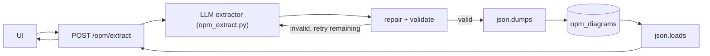

# spec-db.md

# Phase 1 Spec — OPM Persistence & API

> Scope: Introduce OPM diagrams as persistent system artifacts by adding a new DB table and new API endpoints. This spec documents the Phase 1 DB and API contracts that later phases must preserve. Phase 2 replaced the stub extractor with an LLM-backed extractor. Phase 3 (integrated with Phase 2) added validation + repair before DB insertion. The DB schema and API response shape defined here remain unchanged.

---

## 1. Overview

This phase introduced a new persistence layer and API surface for OPM diagrams.

The extraction behavior in Phase 1 was intentionally stubbed using a hardcoded diagram. The purpose of the phase was not to evaluate extraction quality, but to establish the system boundary for OPM diagrams:

* a stable diagram payload shape
* a stable DB storage contract
* a stable API response contract

Phase 2 replaced the stub extractor with an LLM-backed extractor. Phase 3 (incorporated into Phase 2) added validation and auto-repair before persistence. The DB schema and API response shape defined here remain stable and unchanged.

---

## 2. Goals

This phase has five goals:

1. Introduce OPM diagrams as first-class persistent objects in the system.
2. Define the initial stored payload format for diagrams:

   * `version`
   * `nodes`
   * `links`
3. Add a new `opm_diagrams` table to the database.
4. Add a new `/opm` API surface for storing and retrieving diagrams.
5. Ensure the DB and API contracts established here remain stable in later phases.

---

## 3. Design Rationale

### 3.1 Why persistence is introduced first

The system is being refactored from a transient action-item extractor into a diagram extraction pipeline. In the target design, diagrams are not merely temporary outputs; they are persistent artifacts that can be:

* retrieved later
* displayed in the frontend without recomputation
* reused by future features such as comparison, manual editing, or schema migration

For that reason, persistence is introduced before LLM integration and before validation. This allows the system to stabilize around a concrete artifact type before adding probabilistic generation or correctness enforcement.

### 3.2 Why this phase uses a stub instead of an LLM

This phase intentionally uses a hardcoded stub diagram rather than a real model output. This isolates persistence and API concerns from extraction concerns.

If LLM behavior were introduced here, debugging failures would become ambiguous:

* Is the bug in extraction?
* Is the bug in serialization?
* Is the bug in DB storage?
* Is the bug in API response formatting?

By using a deterministic stub, this phase ensures that persistence and retrieval behavior can be tested independently.

### 3.3 Stable contracts established in this phase

This phase freezes three contracts that later phases must preserve:

1. **Diagram payload shape**

   * A diagram is represented as a JSON object with top-level fields:

     * `version`
     * `nodes`
     * `links`

2. **DB storage contract**

   * Diagram payload is stored as a JSON string in `payload TEXT`
   * The database does not decompose nodes or links into separate relational tables in this phase

3. **API response contract**

   * `POST /opm/extract` returns:

     * `note_id`
     * `diagram_id`
     * `diagram`
   * `GET /opm` returns a list of stored diagrams
   * `GET /opm/{id}` returns a single stored diagram

Later phases may replace internals, but should not break these contracts.

### 3.4 Definition of `version`

The `version` field in the diagram payload is defined in this phase as:

* the schema version of the stored OPM diagram payload
* fixed to `"1.0"` in this phase

It is explicitly **not**:

* a user session identifier
* a note revision number
* a diagram history version
* a conversation turn id

Those concepts may be introduced in future work, but are out of scope here.

### 3.5 Role of `note_id`

A diagram may optionally be associated with a note.

Rules in this phase:

* `note_id` is nullable
* if `save_note = true`, the router may create or reuse a note and store its id
* if `save_note = false`, `note_id` is stored as `NULL`
* the existing note system is not redesigned in this phase

The `note_id` field exists to preserve compatibility with the current application pattern, where user text may optionally be stored as a note alongside extracted output.

---

## 4. Constraints

This phase has the following hard constraints:

* No LLM integration
* No validation logic
* No changes to existing `action_items` behavior
* No removal of existing routes, tables, or features
* Additive changes only
* Hardcoded diagrams are assumed valid for this phase
* No frontend graph rendering requirements in this phase
* No schema migration/version upgrade workflow in this phase
* No update or delete operations for diagrams in this phase

---

## 5. Scope

### Included

This phase includes:

* a new `opm_diagrams` table
* DB helper functions for:

  * insert
  * list
  * get-by-id
* a stub extractor that returns a hardcoded diagram
* new API endpoints:

  * `POST /opm/extract`
  * `GET /opm`
  * `GET /opm/{id}`

### Excluded

This phase excludes:

* calling any LLM backend
* validating diagram correctness
* enforcing graph integrity
* frontend graph visualization
* diagram editing
* diagram deletion
* migration of legacy `action_items`
* replacing or removing old routes

---

## 6. Data Model

### 6.1 Stored diagram schema

The stored diagram payload has the following shape:

```json
{
  "version": "1.0",
  "nodes": [],
  "links": []
}
```

### 6.2 Field semantics

* `version`: schema version string, fixed to `"1.0"`
* `nodes`: array of node objects
* `links`: array of link objects

This phase does not yet validate the internal schema of `nodes` or `links`. It only establishes the top-level payload contract.

### 6.3 Storage format

The diagram is stored as a JSON string:

* serialized with `json.dumps`
* stored in the DB as `TEXT`
* deserialized with `json.loads` when read back

SQLite is sufficient for this phase. The purpose of the phase is not to optimize JSON storage, but to establish a stable persistence boundary.

---

## 7. Data Lifecycle

The lifecycle of a diagram in this phase is:

1. Client sends `POST /opm/extract`
2. Router receives input text
3. Stub extractor returns a hardcoded diagram dict
4. Diagram dict is serialized to JSON
5. Serialized payload is inserted into `opm_diagrams`
6. API response returns:

   * `diagram_id`
   * `note_id`
   * parsed `diagram`
7. Client may later call:

   * `GET /opm`
   * `GET /opm/{id}`

### Key property

The database is the source of truth for extracted diagrams.

That means:

* a successful extraction always results in a stored diagram
* retrieval endpoints serve from DB state, not in-memory cache
* later phases should preserve this invariant

---

## 8. Proposed System

### 8.1 Current pipeline

```text
Text → LLM Extractor → JSON Parse → Repair → Validate → DB → API → Client
```

### 8.2 Architecture diagram (current)



### 8.3 Current behavior

* extraction uses OpenAI-compatible LLM (default: `gpt-4o-mini`)
* auto-repair corrects common LLM mistakes (result↔effect, agent→instrument for non-human sources)
* validation rejects invalid diagrams before persistence
* DB schema and API response shape are unchanged from Phase 1

---

## 9. Module Layout

### 9.1 Extractor module

The LLM-backed extractor lives in:

```text
web/app/services/opm_extract.py
```

(Phase 1 used a hardcoded stub in the same module path; Phase 2 replaced it with the current LLM implementation.)

### 9.2 DB functions module

DB helper functions may live in:

```text
web/app/db.py
```

or in a dedicated module if the project is being refactored cleanly. If a dedicated module is used, it should be explicitly imported by the router and should not break existing DB helpers.

### 9.3 Router module

The new API endpoints should live in:

```text
web/app/routers/opm.py
```

This phase must not alter the old action-items router.

---

## 10. Implementation

### 10.1 Extractor (current)

`extract_opm_diagram(text: str) -> dict` in `web/app/services/opm_extract.py`.

Returns a repaired, Pydantic-validated diagram dict, or raises `OPMExtractionError`. See `spec-llm.md` §14 for the full implementation pseudocode.

### 10.2 Database schema

```sql
CREATE TABLE IF NOT EXISTS opm_diagrams (
  id INTEGER PRIMARY KEY AUTOINCREMENT,
  note_id INTEGER,
  payload TEXT NOT NULL,
  created_at TIMESTAMP DEFAULT CURRENT_TIMESTAMP
);
```

### 10.3 DB helper functions

Suggested signatures:

```python
def insert_opm_diagram(payload: dict, note_id: int | None = None) -> int:
    """Serialize payload, insert row, return new diagram id."""

def list_opm_diagrams(note_id: int | None = None) -> list[dict]:
    """Return stored diagrams, optionally filtered by note_id."""

def get_opm_diagram(diagram_id: int) -> dict | None:
    """Return one stored diagram or None if not found."""
```

### 10.4 API behavior

#### POST /opm/extract

Request shape:

```json
{
  "text": "...",
  "save_note": true
}
```

Behavior:

* receives user text
* calls stub extractor
* optionally creates/saves note
* inserts diagram into DB
* returns stored diagram

Response shape:

```json
{
  "note_id": 1,
  "diagram_id": 10,
  "diagram": {
    "version": "1.0",
    "nodes": [],
    "links": []
  }
}
```

#### GET /opm

Behavior:

* returns all diagrams
* optionally may support note filtering later, but not required in Phase 1

Example response shape:

```json
{
  "diagrams": [
    {
      "id": 10,
      "note_id": 1,
      "created_at": "2026-03-27T12:00:00",
      "diagram": {
        "version": "1.0",
        "nodes": [],
        "links": []
      }
    }
  ]
}
```

#### GET /opm/{id}

Behavior:

* returns a single diagram by id
* returns 404 if not found

Example response shape:

```json
{
  "id": 10,
  "note_id": 1,
  "created_at": "2026-03-27T12:00:00",
  "diagram": {
    "version": "1.0",
    "nodes": [],
    "links": []
  }
}
```

---

## 11. Testing Plan

### 11.1 Unit tests

Test JSON storage round-trip explicitly.

Example assertion:

```python
original = {
    "version": "1.0",
    "nodes": [{"id": "example-object", "kind": "object", "label": "example"}],
    "links": []
}

encoded = json.dumps(original)
decoded = json.loads(encoded)

assert decoded == original
```

This is the intended meaning of “DB payload round-trip integrity”: after serialization and deserialization, the diagram payload is unchanged.

Additional unit tests:

* `version` field is preserved
* insert function returns integer id
* get-by-id returns parsed dict, not raw JSON string

### 11.2 Integration tests

* `POST /opm/extract` inserts a row
* `GET /opm/{id}` returns the same payload that was inserted
* multiple inserts produce distinct ids
* `note_id` is `NULL` when `save_note = false`
* payload returned by the API matches payload stored in DB

### 11.3 Contract tests

Contract tests should assert:

* top-level API response shape is stable
* top-level diagram payload shape is stable
* later internal changes do not break:

  * `version`
  * `nodes`
  * `links`

---

## 12. Success Criteria

This phase is successful if:

* diagrams can be stored in `opm_diagrams`
* diagrams can be retrieved through API
* the stub extractor can drive the full persistence flow
* the API response contract is stable and testable
* no existing action-items behavior is broken

---

## 13. Remaining Limitations

The following limitations persist after Phase 2/3:

* no update/delete flow for diagrams
* no migration of legacy `action_items` data
* no frontend graph editing
* repeated LLM calls may produce different graph content for the same input
* semantic correctness of diagrams is not guaranteed beyond schema/direction rules
