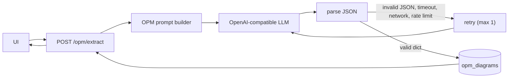

# spec-llm.md

# Phase 2 Spec — LLM Integration for OPM Extraction

> Scope: Replace the Phase 1 stub extractor with an LLM-backed extractor that returns candidate OPM diagrams as JSON. This phase defines how the LLM should interpret text into OPM structure, how JSON parsing behaves, and how LLM-specific failures are handled. Validation remains out of scope for this phase.

---

## 1. Overview

This phase replaces the stub extractor introduced in Phase 1 with a real LLM-based extraction mechanism.

The purpose of this phase is not merely to call an LLM. It is to define:

* how the model should understand OPM-style structure
* what schema it must return
* how the service parses that response
* what happens when the model produces invalid or unusable output

This phase preserves the Phase 1 DB schema and API response contract.

---

## 2. Goals

This phase has six goals:

1. Replace the stub extractor with an LLM-backed extractor.
2. Define a precise OPM extraction contract for the model.
3. Require strict JSON output matching the agreed diagram schema.
4. Preserve compatibility with:

   * Phase 1 DB schema
   * Phase 1 API contract
5. Define deterministic behavior for JSON parsing failures.
6. Define retry and timeout behavior for LLM-specific failures.

---

## 3. Design Rationale

### 3.1 Role of the LLM

The LLM is treated as:

> a probabilistic generator of candidate OPM diagrams

Its role is limited to:

* identifying candidate objects, processes, and optional states
* proposing typed relations between them
* emitting a candidate JSON object

The LLM is **not** the source of truth for correctness.

It does not guarantee:

* schema validity
* graph integrity
* semantic completeness
* consistency across repeated calls

Those responsibilities are deferred to Phase 3.

### 3.2 Why OPM guidance must be explicit

Generic prompting is not sufficient for this task.

Without explicit OPM guidance, the model may:

* confuse objects and processes
* return prose instead of JSON
* invent unsupported relation types
* create oversized or noisy diagrams
* violate link direction conventions

For that reason, this phase must define:

* node categories
* allowed relation types
* relation direction rules
* omission behavior under uncertainty
* exact JSON schema to return

### 3.3 Why validation is deferred

Validation is intentionally not implemented in this phase.

This is done to keep concerns separated:

* Phase 2 = generation and parsing
* Phase 3 = correctness enforcement

This separation makes failure analysis clearer:

* parse failure belongs to the LLM layer
* invalid graph structure belongs to the validation layer

### 3.4 What the `version` field means

The `version` field in the returned JSON:

* represents the schema version of the diagram payload
* is fixed to `"1.0"` in this phase
* is not related to session tracking
* is not related to diagram revision history

The LLM should return `"version": "1.0"` in every output.

---

## 4. Constraints

This phase has the following hard constraints:

* Must not change DB schema
* Must not change top-level API response shape
* Must not introduce validation logic
* Must return either:

  * a Python `dict`, or
  * an exception
* Must not return `None`
* Must use only allowed OPM node and relation types in the prompt contract
* Must prefer omission over hallucination
* Must preserve the Phase 1 module boundary for `extract_opm_diagram`

---

## 5. Scope

### Included

This phase includes:

* OpenAI-compatible client integration
* environment-based model configuration
* OPM prompt design
* raw JSON parsing
* timeout behavior
* retry behavior
* error mapping for LLM/parsing failures

### Excluded

This phase excludes:

* graph validation
* Pydantic validation
* graph repair
* semantic correction of invalid diagrams
* DB schema changes
* API schema changes

---

## 6. OPM Extraction Contract

The extractor must produce candidate diagrams according to the following semantic rules.

### 6.1 Node types

#### Object

An object is a physical or informational entity that exists in the domain (noun).

Examples:

* farmer, patient, clinician (human objects — use `agent` link)
* drug, enzyme, receptor, device, compound (non-human objects — use `instrument` link)
* water, crop, machine, package

Use `kind = "object"` for nouns or noun phrases that refer to system entities.

#### Process

A process is a transformation that creates/consumes an object or changes its state.

**Label must be a verb phrase or gerund** (e.g. "Administering warfarin", "Binding receptor"). Never use a standalone noun as a process label — words like "Indication", "Therapy", "Management", "Treatment", "Use" used as nouns are NOT valid process labels.

Examples (correct verb phrase labels):

* "Irrigating crops"
* "Transporting package"
* "Administering drug"
* "Metabolising compound"

Use `kind = "process"` for verb phrases describing what happens.

#### State

A state is a specific condition or outcome an object can be in.

Medical goals, indications, approved uses, and conditions are states — not processes.

Examples:

* wet, open, active, broken
* "Chronic weight management", "Long-term diabetes control", "Indicated for obesity" — all states
* therapeutic effect, adverse event, toxicity, bleeding risk

Use `kind = "state"` when the text describes a condition, goal, or outcome.

### 6.2 Allowed relation types

Only the following relations are allowed.

#### Procedural relations

* `agent`: an **intelligent, human or human-like enabler** performs or initiates a process. Use only when the source is a person, patient, clinician, or organisation. Never use for drugs, molecules, enzymes, devices, or any non-human entity.
* `instrument`: a **non-intelligent physical enabler** is used by a process but not consumed. This covers drugs, compounds, enzymes, receptors, devices, software, documents, and all non-human objects.
* `consumption`: object is consumed by a process
* `result`: process produces an object
* `effect`: process changes the condition/state of an object (target must be a `state` node)

#### Structural relations

* `aggregation`: part-whole relation
* `specialization`: subtype relation
* `characterization`: object has a state or attribute

#### agent vs instrument — ISO/OPM rule

Per ISO/PAS 19450:

* `agent` → intelligent enabler only (human: patient, clinician, physician, nurse, organisation)
* `instrument` → non-intelligent physical enabler (drug, molecule, enzyme, receptor, tool, device, software, document)

**Any drug, compound, receptor, enzyme, or piece of equipment is always `instrument`, never `agent`.**

### 6.3 Link direction rules

The model must follow these conventions:

* `agent`: human object → process
* `instrument`: non-human object → process
* `consumption`: object → process
* `result`: process → object (never process → state; use `effect` instead)
* `effect`: process → state
* `characterization`: object → state

Auto-repair is applied before validation: `result` with a `state` target is corrected to `effect`; `effect` with an `object` target is corrected to `result`; `agent` from a non-human source is corrected to `instrument`.

For `aggregation` and `specialization`, orientation must be consistent within a diagram.

### 6.4 Extraction principles

The model must follow these principles:

* Extract only what is supported by the input text
* Prefer a minimal sufficient graph
* Avoid duplicate nodes with the same meaning
* Omit uncertain nodes or links
* Do not import outside knowledge
* Do not attempt a complete world model
* Return compact, salient structure only

---

## 7. Diagram Schema

The LLM must return exactly one JSON object with this shape:

```json
{
  "version": "1.0",
  "nodes": [
    { "id": "farmer", "kind": "object", "label": "farmer" },
    { "id": "irrigate", "kind": "process", "label": "irrigate" }
  ],
  "links": [
    { "id": "farmer-agent-irrigate", "source": "farmer", "target": "irrigate", "relation": "agent" }
  ]
}
```

### 7.1 Field semantics

#### Node fields

* `id`: unique kebab-case identifier
* `kind`: one of `object`, `process`, `state`
* `label`: human-readable label

#### Link fields

* `id`: unique identifier
* `source`: source node id
* `target`: target node id
* `relation`: one of the allowed relation enums

### 7.2 Output discipline

The LLM must return:

* exactly one top-level JSON object
* no markdown fences
* no explanation
* no surrounding prose

---

## 8. Prompt Contract

### 8.1 System prompt requirements

The system prompt must define:

* node type interpretation (with pharmaceutical domain vocabulary block)
* agent vs instrument distinction (ISO/OPM standard — human vs non-human)
* kind-selection quick test (exists → object; transforms → process; condition/goal → state)
* allowed relations and direction rules
* schema shape
* omission policy
* minimal graph policy
* few-shot examples covering: mechanism of action, clinical protocol with adverse event, generic drug indication (showing wrong vs correct)

### 8.2 System prompt structure

The system prompt is built by `build_system_prompt()` and contains the following blocks in order:

**1. Role declaration**
```text
You are an OPM (Object-Process Methodology) diagram extraction engine.
```

**2. Output format**
Return exactly one JSON object — no markdown fences, no prose.

**3. Pharmaceutical domain vocabulary block**

Pre-classifies pharma terms by node kind:

| kind | examples |
|------|----------|
| `object` (entities) | drug, compound, receptor, enzyme, metabolite, protein, antibody, dose, carrier, pathway, inhibitor, agonist, antagonist, substrate, cell, tissue, ligand |
| `process` (verb phrases/gerunds) | binding, inhibiting, activating, metabolising, administering, blocking, releasing, distributing, targeting, synthesising, degrading, absorbing, interacting, phosphorylating |
| `state` (conditions/outcomes) | therapeutic effect, adverse event, toxicity, resistance, bioavailability, side effect, overdose, bleeding risk, reduced efficacy, contraindication, tolerance |
| agent objects (human) | patient, clinician, physician, nurse, healthcare provider |
| instrument objects (non-human) | drug, enzyme, receptor, device, compound, antibody, carrier |

**4. Node kind definitions with kind-selection test**

* **object**: physical or informational entity (noun). Quick test: does it *exist*?
* **process**: transformation — label **must** be a verb phrase or gerund (e.g. "Administering warfarin"). Standalone nouns ("Indication", "Therapy", "Management", "Treatment") are NOT valid process labels.
* **state**: condition, goal, or outcome of an object. Medical goals, indications, and approved uses are states (e.g. "Chronic weight management", "Long-term diabetes control").

Kind-selection quick test: *exists* → object; *transforms* → process; *condition/goal* → state.

**5. Agent vs instrument rule (ISO/OPM)**

* `agent` → intelligent, human or human-like enabler only (person, patient, clinician, organisation)
* `instrument` → non-intelligent enabler (drug, molecule, enzyme, tool, device, software, document)

Any drug, compound, receptor, enzyme, or equipment is **always instrument, never agent**.

**6. Link direction rules**

* agent / instrument / consumption: object → process
* result: process → object (NEVER process → state)
* effect: process → state
* characterization: object → state

**7. Extraction principles**

Extract only what is supported by the text. Prefer minimal sufficient graph. Omit uncertain nodes or links. Do not invent structure.

**8. Three few-shot examples**

*Example 1 — Mechanism of action*: GLP-1 receptor agonist binds GLP-1 receptor → drug as instrument, receptor as instrument, process → result → object, process → effect → state.

*Example 2 — Clinical protocol + adverse event*: Warfarin administered to patient; liver metabolises via CYP2C9; drug–drug interaction → cascade with patient as agent, warfarin as instrument/consumption, process → result → object → instrument → process → effect → bleeding-risk state.

*Example 3 — Generic drug indication (shows WRONG vs CORRECT)*: Source: "[Drug X] indicated for long-term weight management." WRONG: drug as agent, "Weight management" as process. CORRECT: drug as instrument, "Administering [Drug X]" as process, "Long-term weight management" as state with characterization link. Uses a generic `[Drug X]` placeholder so the pattern applies to any drug name.

### 8.3 User prompt shape

```text
Extract an OPM diagram from the following text:

<text>
{user_text}
</text>
```

---

## 9. Proposed System

### 9.1 Phase pipeline

```text
Text → Prompt Builder → LLM → JSON Parse → DB → API → Client
```

### 9.2 Architecture diagram with retry path



### 9.3 Important note

Validation and auto-repair (`repair_common_llm_link_relations` + `validate_diagram`) are applied between `parse JSON` and `DB`. Invalid diagrams are rejected before storage and trigger a retry with feedback injected into the next LLM prompt.

---

## 10. JSON Parsing Contract

The parsing layer must be explicit and deterministic.

### 10.1 `parse_json` behavior

```python
import json

def parse_json(raw: str) -> dict:
    """
    Parse LLM output into a Python dict.

    Behavior:
    - If JSON decoding fails, raise ValueError("Invalid JSON")
    - If decoded JSON is not a dict, raise ValueError("JSON must be object")
    - Never return None
    """
    try:
        data = json.loads(raw)
    except Exception as exc:
        raise ValueError("Invalid JSON") from exc

    if not isinstance(data, dict):
        raise ValueError("JSON must be object")

    return data
```

### 10.2 Boundary guarantee

At the end of Phase 2:

* `extract_opm_diagram(text)` must either:

  * return a Python `dict`, or
  * raise an exception

It must not:

* swallow parse failures
* return `None`
* return a raw JSON string

This guarantee is required for Phase 3 to remain cleanly decoupled.

---

## 11. LLM Call Contract

### 11.1 Environment variables

* `OPM_MODEL` — model name; defaults to `gpt-4o-mini` if unset
* `OPENAI_API_KEY` — required for OpenAI API calls
* `OPENAI_BASE_URL` — optional; override for custom/compatible endpoints

### 11.2 Timeout

The LLM call timeout is:

* **30 seconds**

If a timeout occurs:

* treat it as an LLM/network failure
* retry once
* if retry also fails, raise an error

### 11.3 Retry and repair policy

The extractor uses a multi-round loop controlled by `OPM_MAX_LLM_ROUNDS` (default 4).

Each round:
1. Call LLM → parse JSON
2. Apply `repair_common_llm_link_relations` (auto-fix result↔effect swap, agent→instrument for non-human sources)
3. Call `validate_diagram` — if it passes, return the repaired dict
4. If validation fails and rounds remain, retry with an updated prompt that includes the validation error

LLM-level failures (network error, timeout, rate limit, invalid JSON) also trigger a retry up to the round limit.

Do not retry for:

* non-object JSON after successful parse (immediate 422)
* repeated failure after all rounds exhausted

---

## 12. Error Handling

### 12.1 Failure matrix

| Failure Type    | Retry | HTTP Status |
| --------------- | ----- | ----------- |
| Network error   | yes   | 502         |
| Timeout         | yes   | 502         |
| Rate limit      | yes   | 502         |
| Invalid JSON    | yes   | 422         |
| Non-object JSON | no    | 422         |
| Empty response  | no    | 502         |

### 12.2 Error response format

All Phase 2 extraction failures should map to a consistent error shape:

```json
{
  "error": "opm_extraction_failed",
  "stage": "llm",
  "detail": "invalid or unusable LLM output",
  "raw_response": "..."
}
```

Rules:

* `stage` must be `"llm"`
* `raw_response` should be included when available
* for network/timeout failures where no raw response exists, `raw_response` may be `null`

### 12.3 Unified LLM Exception Contract

The LLM layer must not leak provider-specific exceptions (for example, raw OpenAI client exceptions) to the router.

Instead, all LLM-related failures must be normalized into a single application-level exception type, for example:

```python
class OPMExtractionError(Exception):
    def __init__(self, status_code: int, detail: str, raw_response: str | None = None):
        self.status_code = status_code
        self.detail = detail
        self.raw_response = raw_response
        super().__init__(detail)
```

This exception is the only exception type that the router is expected to catch for LLM-layer failures.

#### Status code mapping

The normalized exception must carry the HTTP status code that should be returned by the router.

Use the following mapping:

* invalid JSON → `status_code = 422`
* non-object JSON → `status_code = 422`
* network error → `status_code = 502`
* timeout → `status_code = 502`
* rate limit → `status_code = 502`
* empty response → `status_code = 502`

#### Routing rule

The router must not re-interpret raw provider exceptions.
It should catch `OPMExtractionError` and forward:

* `exc.status_code`
* `exc.detail`
* `exc.raw_response`

This keeps the LLM layer responsible for failure classification and keeps router behavior consistent across implementations.


---

## 13. Module Layout

### 13.1 Extractor module

The extraction function should remain in:

```text
web/app/services/opm_extract.py
```

This preserves continuity with Phase 1.

### 13.2 Helper functions

Current structure in `opm_extract.py`:

* `build_system_prompt() -> str` — builds full system prompt with vocab block, kind definitions, few-shot examples, and direction rules
* `build_user_prompt(text: str) -> str` — wraps user text in extraction request
* `call_llm(system: str, user: str) -> str` — calls OpenAI-compatible API with 30s timeout; model defaults to `gpt-4o-mini`
* `parse_json(raw: str) -> dict` — parses raw LLM string; raises `ValueError` on failure
* `extract_opm_diagram(text: str) -> dict` — orchestrates the full loop (LLM → parse → repair → validate → retry)

Repair functions in `opm_validate.py`:

* `repair_common_llm_link_relations(data: dict) -> dict` — deep copy + endpoint normalisation + relation repair
* `validate_diagram(data: dict) -> OpmDiagram` — Pydantic validation with graph-integrity checks

---

## 14. Implementation

```python
def extract_opm_diagram(text: str) -> dict:
    system_prompt = build_system_prompt()
    user_prompt = build_user_prompt(text)

    for attempt in range(OPM_MAX_LLM_ROUNDS):
        raw = call_llm(system_prompt, user_prompt)  # timeout = 30s; raises OPMExtractionError on LLM failure
        data = parse_json(raw)                       # raises OPMExtractionError on parse failure
        repaired = repair_common_llm_link_relations(data)
        try:
            diagram = validate_diagram(repaired)
            result = diagram.model_dump(mode="json")
            if _should_auto_expand(text, result):
                expanded = _try_expand_diagram_once(text, result, system_prompt)
                if expanded is not None:
                    return expanded
            return result
        except (ValidationError, ValueError) as exc:
            if attempt == OPM_MAX_LLM_ROUNDS - 1:
                raise OPMExtractionError(422, humanize_diagram_validation(exc)) from exc
            # inject validation feedback into next user prompt
            user_prompt = _build_retry_user_prompt(text, repaired, exc)

    raise OPMExtractionError(422, "Extraction failed after all rounds")
```

Key guarantees:
* Always returns a repaired, Pydantic-validated `dict` (via `model_dump(mode="json")`) — never the raw unrepaired LLM output.
* Raises `OPMExtractionError` on all failure paths; never returns `None`.
* Validation happens before DB insert (Phase 3 is already enforced here in practice).

---

## 15. Testing Plan

### 15.1 Unit tests (prompt content)

* system prompt contains pharmaceutical object vocabulary (drug, compound, receptor, enzyme, …)
* system prompt contains process vocabulary as gerunds (metabolising, administering, activating, …)
* system prompt contains state vocabulary (therapeutic effect, adverse event, toxicity, …)
* system prompt contains mechanism-of-action few-shot example (checks for `glp1_agonist`)
* system prompt contains clinical protocol few-shot example (checks for `warfarin`)
* system prompt contains generic drug indication example (checks for `[Drug X]` placeholder)

### 15.2 Unit tests (parse_json)

* `parse_json` returns dict for valid object JSON
* `parse_json` raises `ValueError("Invalid JSON")` for malformed JSON
* `parse_json` raises `ValueError("JSON must be object")` for non-object JSON (e.g. array)

### 15.3 Unit tests (call_llm)

* `call_llm` defaults to `gpt-4o-mini` when `OPM_MODEL` is unset
* `call_llm` uses `OPM_MODEL` when set

### 15.4 Repair tests (opm_validate)

* `result` with process source and state target → repaired to `effect`
* `effect` with process source and object target → repaired to `result`
* `agent` from non-human source (e.g. "diet", brand drug name) → repaired to `instrument`
* `agent` from human source (e.g. "patient") → not changed

### 15.5 Integration tests

* `POST /opm/extract` with mocked LLM → valid diagram stored in DB, 200 response
* `POST /opm/extract` with invalid diagram → 422, not stored in DB
* API response shape (`diagram`, `id`, `created_at`) unchanged from Phase 1
* extraction LLM failures → consistent `OPMExtractionError` shape

---

## 16. Success Criteria

This phase is successful if:

* the stub extractor is replaced with an LLM-backed extractor
* the LLM is explicitly instructed on OPM structure
* `extract_opm_diagram()` returns `dict` or raises
* retry/timeout behavior is defined and tested
* Phase 1 DB and API contracts remain unchanged

---

## 17. Known Limitations

This phase intentionally has the following limitations:

* no validation layer yet
* invalid but parseable diagrams may still be stored
* repeated calls may not produce identical graph content
* structural relation direction may still need stricter enforcement later
* semantic correctness is not guaranteed
